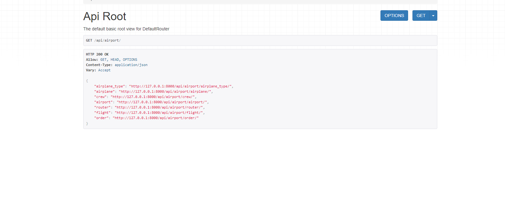

# Airport_API_Service

Django REST Framework API Project 
Project Title: "Airport Service API "

Project Description:

Our "Urban Air Carrier" project is a web application designed to manage air transportation at a local airport. The system is intended for use by airlines, airport administrators, and passengers.


## Installation

Python 3.10.x must be already installed

```shell
git clone https://github.com/CeO-PsH/Airport_API_Service.git
cd Airport_API_Service
pythone -m venv venv
source venv//Scripts//activate
pip install -r requirements.txt
pythone manage.py runserver
```
## Features:
1. **Fleet Management:** Add and edit information about airplanes, including aircraft types, details, and images.
2. **Crew Management:** Add and edit information about flight crews.
3. **Route Management:** Create and edit flight routes, including origin and destination points.
4. **Flight Management:** Add and edit flight schedules, specifying departure dates and routes.
5. **Ticket Booking:** Passengers can browse available flights, select routes, and purchase tickets.
6. **Order Management:** Passengers can view their orders and tickets and cancel bookings.
7. **Administration:** Administrators have access to manage all aspects of the system, including user management, statistics, and event logs.

The project is built using Django and Django REST framework and utilizes the drf-spectacular extension for automated OpenAPI documentation generation. Various libraries and packages are used to simplify web application development.

This project is developed to provide convenience and efficiency in managing air transportation at a local level.

## DEMO!



